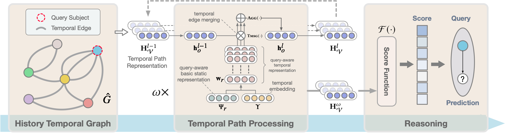

# Temporal Inductive Path Neural Network for Temporal Knowledge Graph Reasoning

This is the official code release of the following paper:

Hao Dong, Pengyang Wang, Meng Xiao, Zhiyuan Ning, Pengfei Wang and Yuanchun Zhou. "[Temporal Inductive Path Neural Network for Temporal Knowledge Graph Reasoning](https://arxiv.org/abs/2309.03251)." Artificial Intelligence 2024.



## Quick Start

### Dependencies

```
python==3.8
torch==1.10.0
torchvision==0.11.1
dgl-cu113==0.9.1
tqdm
torch-scatter>=2.0.8
pyg==2.0.4
```

### Train models

0. Switch to `src/` folder
```
cd src/
``` 

1. Run scripts

```
python main.py --gpus 0 -d YAGO --batch_size 32 --n_epoch 20 --lr 0.0001 --hidden_dims 64 64 64 64 --history_len 8 --time_encoding_independent
```

- To run with multiple GPUs which is **highly recommended**, use the following commands
```
python -m torch.distributed.launch --nproc_per_node=4 main.py --gpus 0 1 2 3 -d YAGO --batch_size 32 --n_epoch 20 --lr 0.0001 --hidden_dims 64 64 64 64 --history_len 8 --time_encoding_independent
```

### Evaluate models

To generate the evaluation results of a pre-trained model (if exist), simply add the `--test` flag in the commands above.

```
python main.py --gpus 0 -d YAGO --batch_size 32 --hidden_dims 64 64 64 64 --history_len 8 --time_encoding_independent --test
```

### Inductive setting

The dataset of inductive setting is also located at `data/`, namely YAGO(1to6). Note that YAGO1-YAGO2, YAGO3-YAGO4, YAGO5-YAGO6 correspond to the three different dataset pairs created with different entity set partition ratios. The statistics and other details can be found in the paper.

Take YAGO1-YAGO2 as an example, to run the inductive prediction, one can train on the training set of YAGO1 and test on the test set of YAGO2, and vice versa. 

```
python inductive.py --gpus 0 -d YAGO2 --batch_size 32 --hidden_dims 64 64 64 64 --history_len 8 --time_encoding_independent --pretrain_name YAGO1
```

Note that one should ensure the pre-trained model is relocated to the model folder of target dataset.

### Change the hyperparameters
To get the optimal result reported in the paper, change the hyperparameters and other setting according to the *Implementation Details* in the [paper](https://arxiv.org/abs/2309.03251). 

## Citation
If you find the resource in this repository helpful, please cite

```bibtex
@article{dong2024temporal,
  title={Temporal Inductive Path Neural Network for Temporal Knowledge Graph Reasoning},
  author={Dong, Hao and Wang, Pengyang and Xiao, Meng and Ning, Zhiyuan and Wang, Pengfei and Zhou, Yuanchun},
  journal={Artificial Intelligence},
  pages={104085},
  year={2024},
  publisher={Elsevier}
}
```
